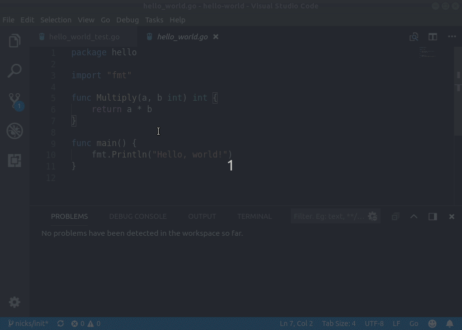

# Go Autotest for VS Code

Have you ever been banging your head against the wall, trying to get that one test to pass?

This VS Code extension for Go projects makes the head banging faster!

Features:
- Automatically runs the tests in a file when you open it.
- Adds an "output" hover button to each test when the test output is aleady known.
- Adds a "pin test" hover button to automatically run a test on every save and keep the status in view.
- Adds code coverage for the pinned test in the left-hand gutter.

## How?

Install this extension from the [VS Code marketplace](https://marketplace.visualstudio.com/items?itemName=windmilleng.vscode-go-autotest#overview).

Intended for use with the [VS Code Go](https://marketplace.visualstudio.com/items?itemName=ms-vscode.Go) extension.

## Why?

Windmill is running small experiments on how to make your existing tools feel
more alive, with fast, responsive feedback. We want to know if this feature fits
into your workflow, or if it feels like a distraction.

[Love it or hate it, we'd appreciate your feedback!](https://airtable.com/shroJMj6X4pcljufb)

## Demo

## Privacy

This extension sends Telemetry reports to Azure Application Insights, to help us
understand what features people use. We only report user actions for commands
added by the extension. We do not report on actions added by other extensions,
or on any passive behavior about how you use VSCode.

We do not share this data with anyone who is not an employee of Windmill Engineering.

You can disable Telemetry by setting `"telemetry.enableTelemetry": false`
under *Preferences > Settings*.

## License
[MIT](LICENSE)

Adapted from [vscode-go](https://github.com/Microsoft/vscode-go/), copyright Microsoft.
